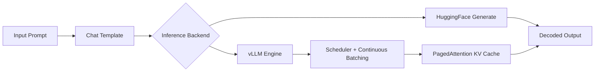
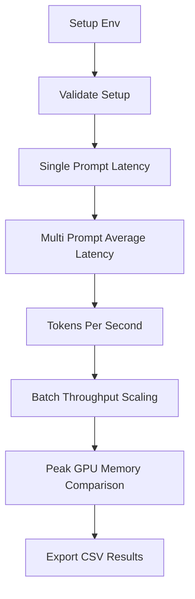

# Accelerating Large Language Model Inference with vLLM
## A Systems-Level Benchmark of HF vs vLLM on CUDA GPUs


This project benchmarks HuggingFace Transformers and vLLM on modern NVIDIA GPUs,
focusing on latency, tokens/sec, throughput scaling, and GPU memory behavior.
It is designed for reproducible, deterministic comparisons with a one-command run path.

## Problem

Production inference systems need:

- Low end-to-end latency
- High throughput under concurrent workloads
- Stable GPU memory behavior
- Predictable scaling as load increases

## Solution

vLLM targets these needs with continuous batching and PagedAttention.
This repository compares those design choices against a standard HuggingFace baseline using deterministic settings.

### At A Glance

| Category | Value |
|---|---|
| Target Hardware | CUDA-capable NVIDIA GPUs |
| Tested GPU in Workspace | NVIDIA RTX A6000 |
| Model | TinyLlama/TinyLlama-1.1B-Chat-v1.0 |
| Precision | FP16 |
| Batch Sizes | 1, 4, 8, 16, 32 |
| Key Output | `vllm_vs_hf_results.csv` |

## Architecture

### Inference Flow



### Benchmark Flow



## Demo Command

### Full One-Command Start (Recommended)

```bash
./run.sh
```

What this does:

- Creates `.venv` if needed
- Installs dependencies
- Validates environment
- Runs deterministic benchmark
- Prints a presenter-friendly summary

### Pass Custom Args

```bash
./run.sh -- --max-new-tokens 64 --output demo_results.csv
```

### Fast Path For Preconfigured Local Environments

```bash
./run.sh --skip-install -- --seed 42 --max-new-tokens 100 --output vllm_vs_hf_results.csv --quiet
```

### Direct Benchmark Command

```bash
python run_benchmark.py --seed 42 --max-new-tokens 100 --output vllm_vs_hf_results.csv --quiet
```

### Setup (Manual)

```bash
python -m venv .venv
source .venv/bin/activate
pip install --upgrade pip
pip install -r requirements.txt
python validate_setup.py
```

If your system requires a specific CUDA wheel for PyTorch, install that wheel first,
then run `pip install -r requirements.txt`.

### Single Script Modes

Use one script for both local and containerized runs.

```bash
./run.sh --mode local -- --batch-sizes 1 4 8
./run.sh --mode docker-nobuild -- --batch-sizes 1
```

## Docker Usage

This repository includes Docker files so you can run the benchmark in a reproducible containerized environment.

### Prerequisites

- Docker Engine 24+
- NVIDIA Container Toolkit (for GPU access)
- NVIDIA driver installed on host

### Build Image

```bash
docker build -f docker/Dockerfile -t vllm-benchmark .
```

If you need a different PyTorch CUDA wheel index:

```bash
docker build -f docker/Dockerfile -t vllm-benchmark \
       --build-arg TORCH_INDEX_URL=https://download.pytorch.org/whl/cu121 .
```

### Run Benchmark (Docker)

```bash
docker run --rm --gpus all \
       -v "$(pwd)":/workspace \
       -w /workspace \
       vllm-benchmark
```

### Run With Custom Benchmark Args

```bash
docker run --rm --gpus all \
       -v "$(pwd)":/workspace \
       -w /workspace \
       vllm-benchmark \
       python run_benchmark.py --seed 42 --max-new-tokens 64 --output demo_results.csv --quiet
```

### Docker Compose

```bash
docker compose -f docker/docker-compose.yml up --build
```

Override CUDA wheel index when needed:

```bash
TORCH_INDEX_URL=https://download.pytorch.org/whl/cu121 docker compose -f docker/docker-compose.yml up --build
```

Run with an alternate command:

```bash
docker compose -f docker/docker-compose.yml run --rm benchmark \
       python run_benchmark.py --batch-sizes 1 4 8 --max-new-tokens 64 --output compose_results.csv --quiet
```

Notes:
- The project directory is mounted into the container at `/workspace`, so generated CSV files appear in your local folder.
- Hugging Face cache is persisted through the named volume `hf-cache` in compose.
- For CPU-only hosts, remove `--gpus all` and set expectations accordingly (this project is designed for CUDA GPUs).

### No-Build Fallback (Restricted Docker Hosts)

Some environments allow `docker run` but block `docker build` due mount or namespace restrictions.
Use the no-build fallback files in this repository.

Run with helper script:

```bash
./run.sh --mode docker-nobuild
```

Run with custom args:

```bash
./run.sh --mode docker-nobuild -- --batch-sizes 1 4 8 --max-new-tokens 64 --output nobuild_results.csv --quiet
```

Run with compose no-build service:

```bash
docker compose -f docker/docker-compose.nobuild.yml up
```

Override PyTorch wheel index if required:

```bash
./run.sh --mode docker-nobuild --torch-index-url https://download.pytorch.org/whl/cu121
```

No-build notes:
- Dependencies are installed at container startup, so first run is slower than a prebuilt image.
- The benchmark output CSV is still written to your local project directory.
- The helper script auto-detects common GPU runtime flags. If detection is wrong, set `DOCKER_GPU_ARG` manually.

Examples:

```bash
DOCKER_GPU_ARG="--gpus all" ./run.sh --mode docker-nobuild
DOCKER_GPU_ARG="--device nvidia.com/gpu=all" ./run.sh --mode docker-nobuild
```

### Troubleshooting

- `docker build` fails with mount/unshare permission errors:
       - Some managed or nested environments block build-time namespace operations.
       - Use `./run.sh --mode docker-nobuild` instead.

- GPU flag errors with Docker runtime:
       - If your host rejects `--gpus all`, force `DOCKER_GPU_ARG="--device nvidia.com/gpu=all"`.
       - If your host supports standard Docker GPU mode, use `DOCKER_GPU_ARG="--gpus all"`.

- Slow startup in docker-nobuild mode:
       - Expected on first run because dependencies are installed in-container each time.
       - Use local mode (`./run.sh`) for faster iteration after environment setup.

## Results

### What Is Measured

1. Single-request latency and tokens/sec
2. Average latency over multiple prompts
3. Decoding throughput (tokens/sec)
4. Batch throughput scaling across [1, 4, 8, 16, 32]
5. Peak GPU memory usage comparison

Latency timing is synchronized with CUDA to avoid async dispatch skew:

```python
torch.cuda.synchronize()
start = time.perf_counter()
# inference call
torch.cuda.synchronize()
latency = time.perf_counter() - start
```

### Reproducibility Notes

Deterministic behavior is controlled by:

- Fixed random seed
- `do_sample=False` for HuggingFace
- `temperature=0.0` for vLLM

With consistent hardware/software, repeated runs should be statistically stable.

### Expected Output (Example)

After running:

```bash
./run.sh --no-venv --skip-install -- --max-new-tokens 8 --batch-sizes 1 --output sample_results.csv --quiet
```

You should see a summary similar to:

```text
SINGLE REQUEST
HF Latency: 3.4389s
vLLM Latency: 0.5150s
HF Tokens/sec: 2.33
vLLM Tokens/sec: 15.53

AVERAGE LATENCY
HF Avg Latency: 0.2745
vLLM Avg Latency: 0.1637

TOKENS PER SECOND
HF Avg Tokens/sec: 29.17
vLLM Avg Tokens/sec: 50.48

GPU PEAK MEMORY (MB)
HF Peak Memory: 2108.74
vLLM Peak Memory: 2106.30
```

And the output CSV will look like:

```csv
Batch Size,HF Throughput,vLLM Throughput,HF Avg Latency,vLLM Avg Latency,HF Avg Tokens/sec,vLLM Avg Tokens/sec,HF Peak Memory MB,vLLM Peak Memory MB
1,3.589560751742418,6.169958786372651,0.27451589247211816,0.16370287016034127,29.172838057318984,50.47738084682244,2108.7412109375,2106.30126953125
```

Note: exact values can vary slightly by GPU, driver, and background load.

### Outputs

- CSV benchmark file: `vllm_vs_hf_results.csv`
- Notebook walkthrough: `vLLM.ipynb`
- CLI benchmark runner: `run_benchmark.py`
- Setup validator: `validate_setup.py`
- Unified launcher: `run.sh`
- Container image spec: `docker/Dockerfile`
- Compose launcher: `docker/docker-compose.yml`
- Compose no-build fallback: `docker/docker-compose.nobuild.yml`

## Why This Matters

- If batch size is 1, HF and vLLM can look closer in latency.
- As batch size grows, vLLM generally scales better in req/sec.
- Tokens/sec improvements usually track better GPU occupancy and KV cache handling.

## Future Extensions

- Multi-GPU tensor parallel benchmarks
- BF16 vs FP16 comparisons
- FlashAttention vs PagedAttention studies
- Quantized inference experiments
- API-level concurrent load testing
